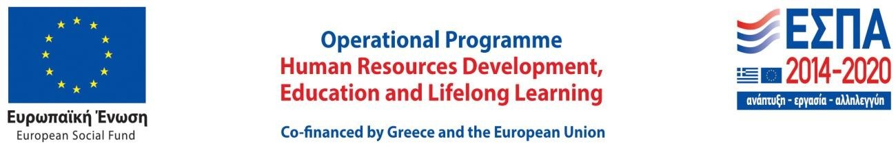

## Earth Time Machine

This is the website of the Earth Time Machine research project.

The main goal of the project is to develop a system for automated 4D reconstruction and mapping of an area of interest through the combined consideration of multi-temporal, multi-modal and multi-scale data from various platforms and sensors. The produced models are a valuable source of information for studying complex social and natural phenomena and they provide the ability to disseminate relevant scientific results to the general public.

This research is co-financed by Greece and the European Union (European Social Fund- ESF) through the Operational Programme «Human Resources Development, Education and Lifelong Learning» in the context of the project “Reinforcement of Postdoctoral Researchers - 2nd Cycle” (MIS-5033021), implemented by the State Scholarships Foundation ([IKY](https://www.iky.gr/en/)).

### Downloads

[ETM Data Management Plan]({{ site.url }}/download/ETM_DMP_2008.pdf)

